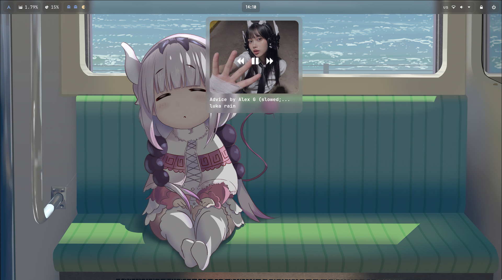
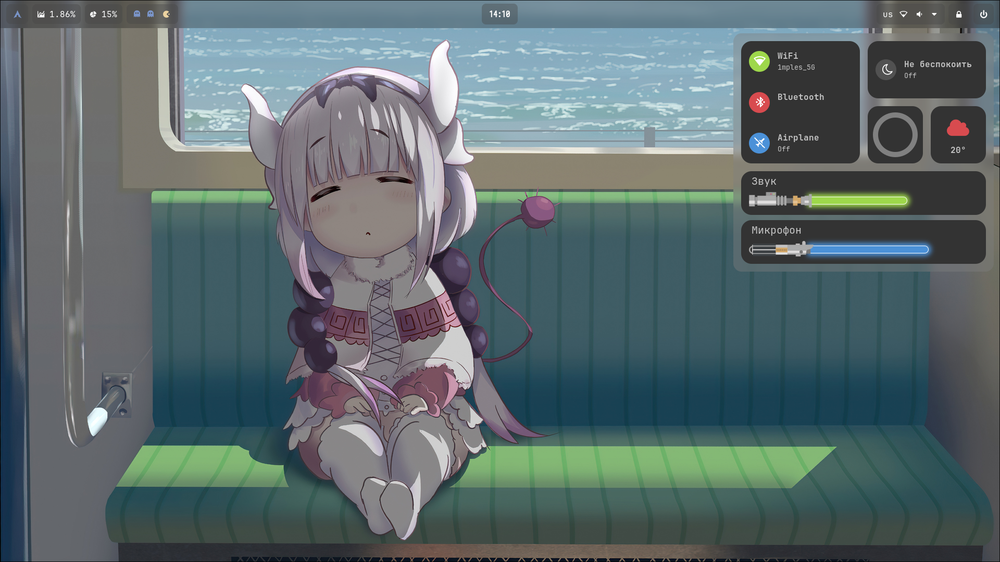
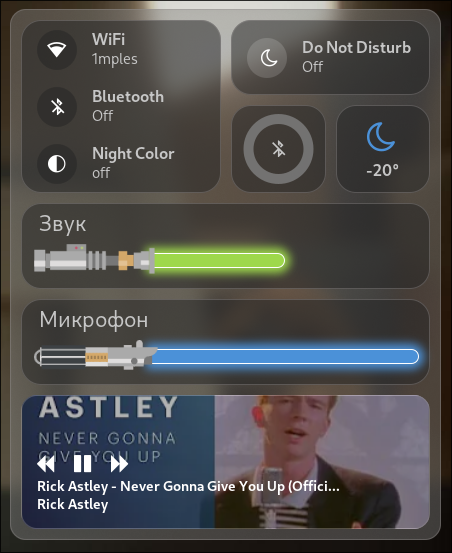

# Hyprland Dotfiles

## Rice

## Widget

#### Этот репозиторий содержит dotfiles для Hyprland, настраиваемой среды рабочего стола, созданной на основе Arch Linux. Эти точечные файлы предназначены для улучшения внешнего вида и функциональности Hyprland.

## Установка

Чтобы использовать эти точечные файлы, выполните следующие действия:

1. Клонируем репозиторий:

~~~
git clone https://gitlab.com/BA_usr/dotfiles-for-hyperland.git
~~~

2. Перейдите в клонированный каталог:

~~~
cd dotfiles-for-hyperland
~~~

3. Установите необходимые пакеты:

~~~
yay -S ttf-twemoji waybar-hyprland-git hyprland-nvidia-git kitty ttf-jetbrains-mono-nerd pavucontrol jq nvidia-settings libnotify dunst slurp grim wl-clipboard xdg-desktop-portal-hyprland libcanberra swaylock-effects wireless_tools pamixer
~~~

4. Настройте dotfiles в соответствии с вашими предпочтениями.

## Функциональность

##### Файлы точек Hyprland предлагают следующие функции:

1. Захват скриншота
- Сделайте снимок экрана, нажав кнопку `Print Screen`. Это позволит вам выбрать конкретную область, чтобы сделать снимок экрана.
 

2. Меню обзора приложений
- Откройте меню обзора приложений, нажав `Alt + R` или щелкнув по логотипу Arch Linux на панели waybar.
 

3. Управление обоями
- Измените обои, нажав , `Alt + W` чтобы открыть меню обоев. Нажатие `Meta + Shift + W` установит случайные обои из коллекции.
 

4. Вызов плеера
- Нажмите сочитание клавиш `Alt + P` для выозва плеера. С помощю данного виджета можно взаимодействовать с потоком музыки, будь то она из браузера или какого-либо проигрывателя.
 

5. Меню быстрых настроек
Для вызова меню быстрых настроек нажмите сочитание клавиш `Alt + с`. В данном меню есть виджет:
<tr>
* WiFi - для подключения к сети и отображения сети;
* Bluetooth - для подключения и отображения включен он или нет;
* Airplane - быстрое отключение от Bluetooth;
* виджет "Не беспокоить" - отключение или включение уведомлений;
* индикатор зарядки подключенного Bluetooth устройства (можно перенастроить для отображения батерии ноутбука, есть скрипты для этого и закоментированный код для этого);
* виджет отображающий погоду;
* слайдер для переключения выходящего и входящего звука.
 
 

6. Быстрый индикатор звука
Данный индикатор отображает звук при изменении его через: 
* сочетание клавиш `Fn + F10` и `Fn + F11`;
* изменение через меню быстрых настроек в ручном режиме.
<tr>
Данный индикатор работает в фоне и появляется только тогда, когда он замечает изменения в уровне звука.

