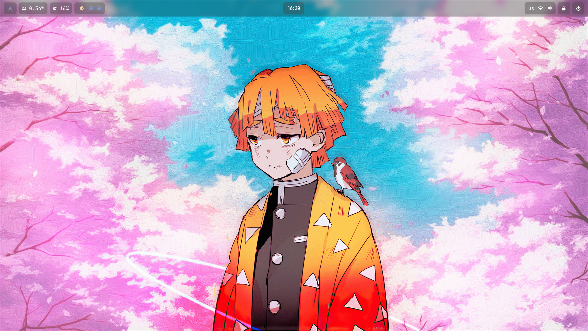
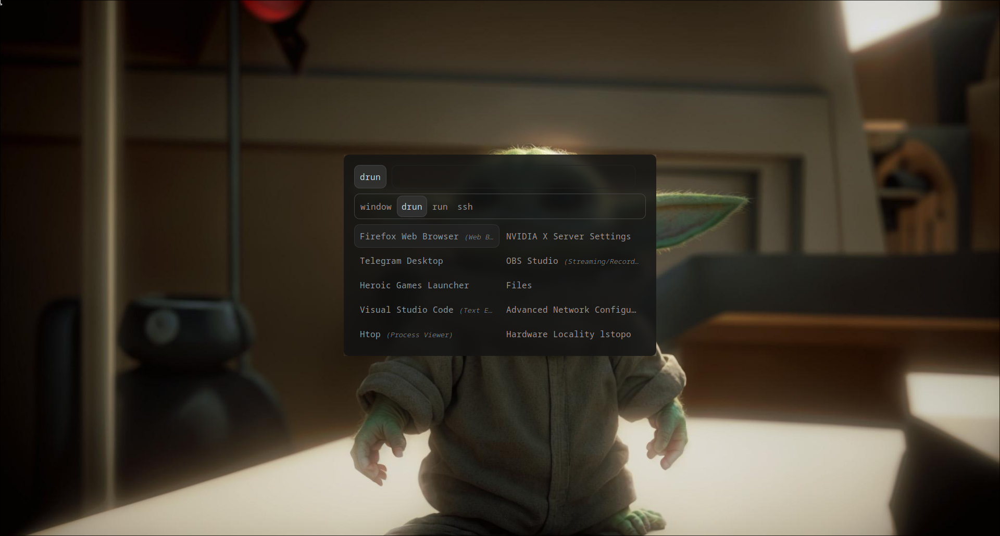

# Hyprland Dotfiles

<video src="Media/rice.mp4" controls title="Title"></video>

Этот репозиторий содержит dotfiles для Hyprland, настраиваемой среды рабочего стола, созданной на основе Arch Linux. Эти точечные файлы предназначены для улучшения внешнего вида и функциональности Hyprland.

## Установка

Чтобы использовать эти точечные файлы, выполните следующие действия:

1. ### Клонируем репозиторий:

 ```git clone https://gitlab.com/BA_usr/dotfiles-for-hyperland.git```

2. ### Перейдите в клонированный каталог:

 ```cd dotfiles-for-hyperland```

3. ### Установите необходимые пакеты:

 ```sudo pacman -S ttf-twemoji waybar-hyprland-git hyprland-nvidia-git kitty ttf-jetbrains-mono-nerd pavucontrol jq nvidia-settings libnotify dunst slurp grim wl-clipboard xdg-desktop-portal-hyprland libcanberra```

4. Настройте dotfiles в соответствии с вашими предпочтениями.

## Функциональность

### Файлы точек Hyprland предлагают следующие функции:

1. ### Захват скриншота
 Сделайте снимок экрана, нажав примерную кнопку «Print Screen». Это позволит вам выбрать конкретную область, чтобы сделать снимок экрана.
 

2. ### Меню обзора приложений
 Откройте меню обзора приложений, нажав Meta + Rили щелкнув логотип Arch Linux на панели.
 

3. ### Управление обоями
 Измените обои, нажав , Meta + Wчтобы открыть меню обоев. Нажатие Meta + Shift + Wустановит случайные обои из коллекции.
 
