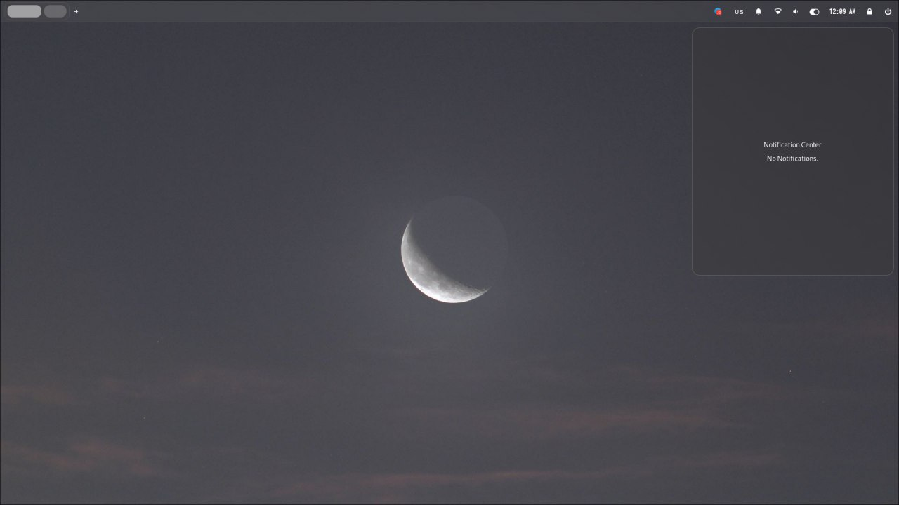
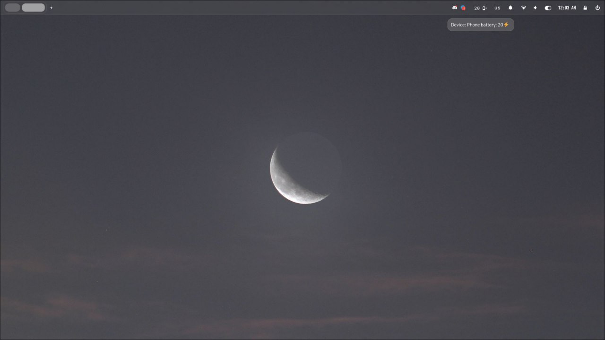
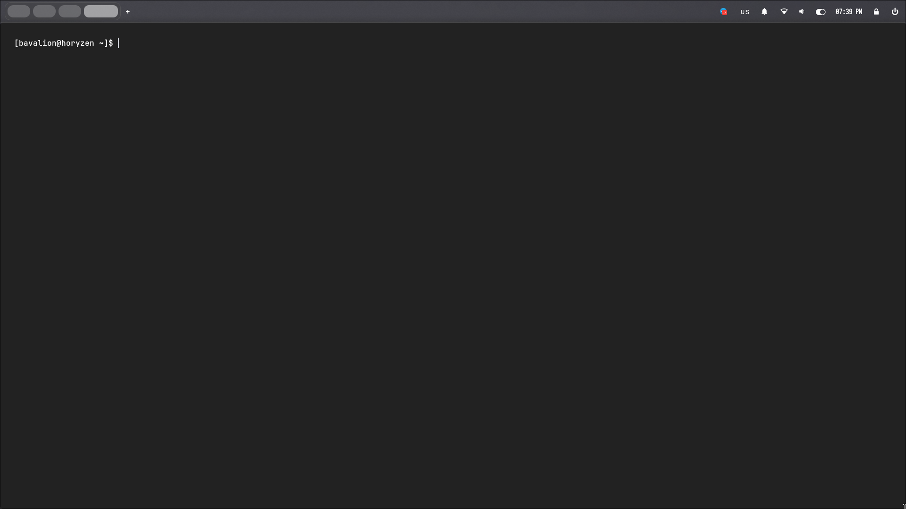
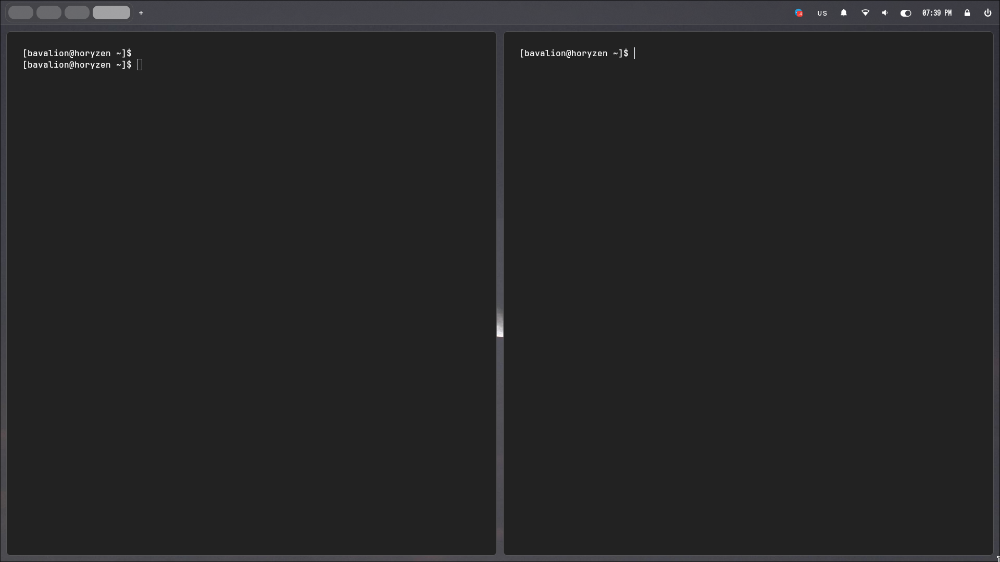

# Hyprland Dotfiles

> Этот репозиторий содержит dotfiles для Hyprland, настраиваемой среды рабочего стола, созданной для дистрибутива на основе Arch Linux. Эти точечные файлы предназначены для улучшения внешнего вида и функциональности Hyprland.

## Установка

   Чтобы использовать эти точечные файлы, выполните следующие действия:

1. Клонируем репозиторий:

~~~
git clone https://gitlab.com/BA_usr/dotfiles-for-hyperland.git
~~~

2. Перейдите в клонированный каталог:

~~~
cd dotfiles-for-hyperland
~~~

3. Установите необходимые пакеты:

~~~
yay -S ttf-twemoji waybar kitty ttf-jetbrains-mono-nerd pavucontrol jq nvidia-settings libnotify dunst slurp grim wl-clipboard xdg-desktop-portal-hyprland libcanberra wireless_tools pamixer xdg-user-dirs blueberry wlrobs-hg hyprshade greetd greetd-gtkgreet cage
~~~

4. Выделите и переместите директорию `.fonts` в вашу домашнюю папку и всё содержимое из `.config` в вашу локальную директорию `config`. Если вы желаете использовать темк иконок как у меня, то переместите папку `.icons` в вашу домашнюю директорию.

5. Настройте dotfiles в соответствии с вашими предпочтениями.

## Функциональность

##### Файлы точек Hyprland предлагают следующие функции:

1. Захват экрана для скриншота
- Сделайте снимок экрана, нажав кнопку `Print Screen`. Это позволит вам выбрать конкретную область, чтобы сделать снимок экрана.

2. Меню обзора приложений

   Открыть меню обзора приложений можно нажав `Alt + R`. Закрыть или выйти из меню обзора можно только нажав по пустому место на экране, или же выбрать приложение для запуска.
 

 > Данный виджет поддерживает работу с любыми темами иконок. Если вы захотите использовать другую тему, то перейдите в файл конфигурации hyprland и укажите свое название темы иконок в `exec-once = gsettings set org.gnome.desktop.interface icon-theme {Название пака}`

3. Управление обоями
- Измените обои, нажав `Alt + W`, чтобы открыть меню обоев. Нажатие `Meta + Shift + W` установит случайные обои из коллекции.
 

4. Меню быстрых настроек. Для вызова меню быстрых настроек нажмите сочетание клавиш `Alt + С`. В данном меню есть виджет:
- WiFi - для подключения к сети и отображения сети;
- Bluetooth - для подключения и отображения включен он или нет;
- Night Color - изменение цветовой гаммы с целью убрать синий свет экана;
- виджет "Do Not Disturb" - отключение или включение уведомлений;
- индикатор зарядки последнего подключенного Bluetooth устройства;
- виджет отображающий погоду;
- слайдер для переключения выходящего и входящего звука;
 

- MPRIS плеер работающий на playerctl.

5. Индикатор звука. Данный индикатор отображает звук при изменении его через: 
- сочетание клавиш `Fn + F10` и `Fn + F11`;
- изменение через меню быстрых настроек в ручном режиме.
   Данный индикатор работает в фоне и появляется только тогда, когда он замечает изменения в уровне звука.

6. Bluetooth меню. Данное меню вызывается из быстрых настроек по нажатию на кнопку Bluetooth.

7. WiFi меню. Данное меню вызывается из быстрых настроек по нажатию на кнопку WiFi.

8. Используя комбинацию клавиш `Meta + Tab`, вы сможете переключать фокус на приложения находящиеся в текущем workspace, так же для этого вы можете использовать сочетания `Meta + Arrows`.

9. Обзор приложений.

   Используя комбинацию клавиш `Alt + Tab`, вы сможете вызвать overview и просмотреть все приложения на всех workspaces. Переключить фокус в overview вы можете мышкой или через комбинации клавиш `Meta + Arrows` или продолжить использовать `Alt + Tab`, удерживая `Alt` и нажимая `Tab`, когда вы отпустите `Alt`, произойдет автоматический выход из обзора.

10. Цент уведомлений.

   Можно вызвать используя комбинацию клавиш `Alt + B`.

11. Bluetooth индикатор.

   Индикатор отображающий есть ли подключенное устройство и если оно подключенно и у вас включена настройка для отображения батареи, то вы сможете увидить объем батареи. Если к вашему пк подключено больше чем одно Bluetooth устройсво, то иконка изменит свой статус на панели и перестанет отображать объем батареии, но что бы по смотреть объем батареи всех устройсв, вы можете нажать на индикатор и появится окно отображающие все устройсва с их статусами.

Ниже пример с одним подключенным устройством:

12. Special workspace.

   Для перемещения приложения в special workspace можно использовать комбинацию `Meta + Shift + C`, если вы хотите переместить приложение и просматривать special workspace, то используйте `Meta + C`. Для того что бы просто просмотреть special workspace, вы можете использовать `Meta + S` и так же если необходимо выйти из этого пространства.

13. Свободное пространство.

   Для перехода в свободное пространство вы можете использовать `Alt + 1` или нажать на значек плюса у индикатора workspace в waybar.

14. Плавующие окна и пространства. 

* Для того что бы переключить в плавующий режим определенное окно, вам нужно что бы оно было в сфокусированном состоянии и по сочетанию `Meta + Shift + E` вы сможете изменить режим окна, так же можно и убрать плавующий режим для окна.

* Для того что бы переключить в плавующий режим целое пространство, вам необходимо использовать сочетание клавиш `Meta + E`, так же можно и убрать плавующий режим для пространства.

15. Авто gaps:

   Данная функция работает таким образом что, если в текущем workspace запущенно только одно приложение, то декорации для окна будут сняты и пробелы между приложением будут убраны, но если вы запустите или уже в workspace больше чем одно приложение, то все декорации и отступы будут включены для приложений.

   

   

## Плагины которые используются:

* Overview - https://github.com/DreamMaoMao/hycov

## Полезные ссылки:

* настройка gtkgreet  
https://www.reddit.com/r/hyprland/comments/13gl7mc/use_hyprland_to_start_gtkgreet/  
https://wiki.archlinux.org/title/Greetd

* настройка bluetooth для отображения батареи  
https://askubuntu.com/questions/1117563/check-bluetooth-headphones-battery-status-in-linux

* как правильно установить proprietary драйвера для nvidia  
https://wiki.hyprland.org/Nvidia/
